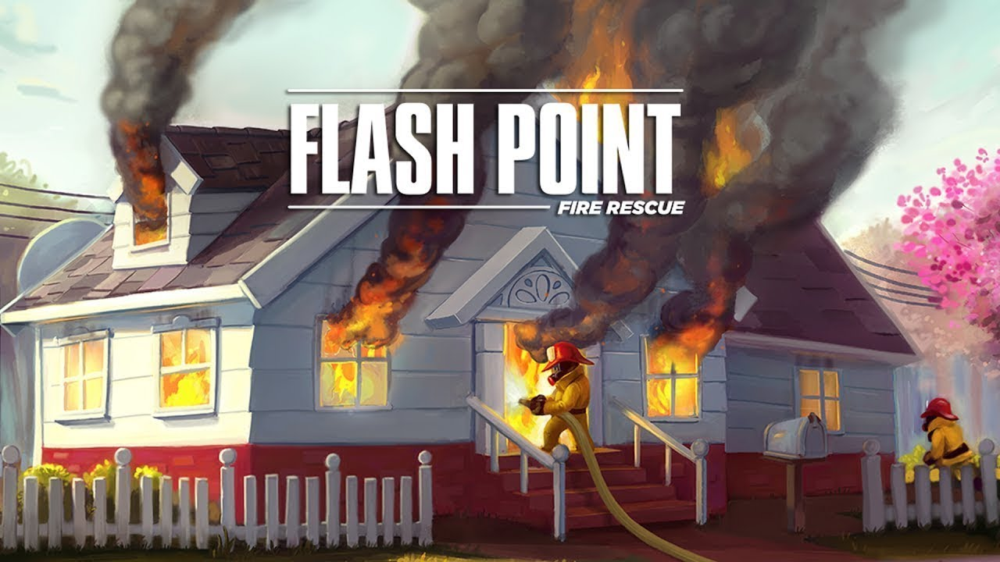

# Flash Point: Fire Rescue

## Team members
- [Abhijay Gupta](https://github.com/atg-abhijay)
- [Alek Bedard](https://github.com/alkbed)
- [Francis Piché](https://github.com/francis-piche)
- [Nuri Amiraslan](https://github.com/Mischief134)
- [Seng Chiat Haw](https://github.com/hawschiat)
- [Teymur Azim-zada](https://github.com/zloifreak144)

Computer game version of the popular [board game](https://boardgamegeek.com/boardgame/100901/flash-point-fire-rescue) by the same name. From the rulebook, the objective of the game is:

> ***Flash Point: Fire Rescue*** is a cooperative game. All the players are on the same team and everyone either wins or loses together. To win, the players must rescue the victims trapped inside a burning building before the fire gets out of control or the building collapses.

Learning the game:

> ***Flash Point: Fire Rescue*** has two different sets of rules. Family rules for learning the game and/or playing with younger children, and the Experienced rules for more seasoned players. The rules are quick to read, and you can even play the game by yourself before teaching it to others.

## Rules

The rules for the game can be found [here](./Flash_Point_Rulebook.pdf). You can also check out these helpful videos to see how the [Family](https://www.youtube.com/watch?v=eRAuAt0XBoE) and [Experienced](https://www.youtube.com/watch?v=aPs8D47iitM) modes work.

The rules for the `Veteran` and `Rescue Dog` roles (only used in the `Experienced` mode) can be found [here](./Veteran_and_Rescue_Dog_Rules.pdf).

## Dependencies

[pygame](https://github.com/pygame/pygame)
